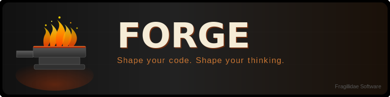
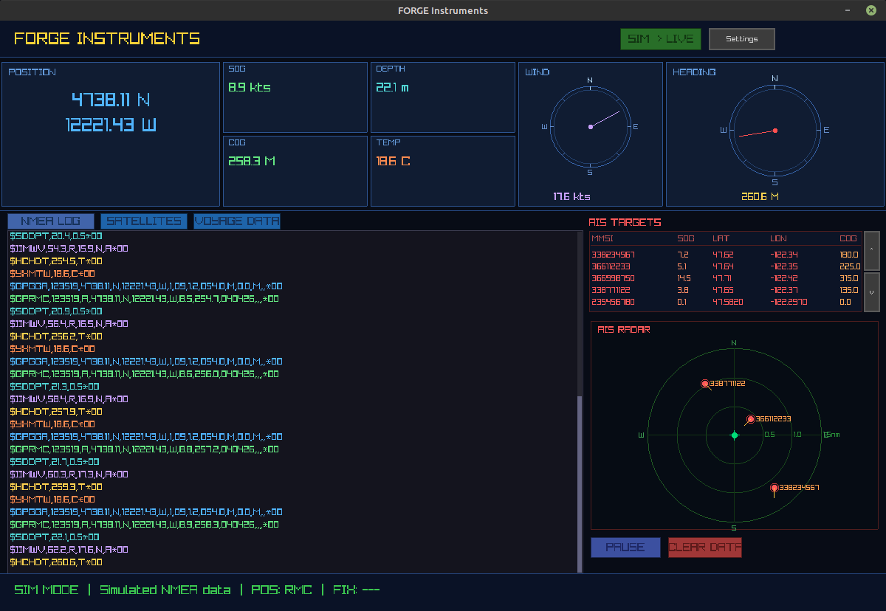

# FORGE

**Fast, Reliable, Organized, General-purpose, Event-driven**

FORGE is a statically-typed, compiled systems programming language built around clarity and control. It features a clean Python-inspired syntax with explicit types, a tree-walking interpreter for rapid development, and a native code compiler via C or LLVM backends. FORGE is designed to be simple to learn while powerful enough for real-world systems work. FORGE is the third of 3 teaching languages developed to help people learn how to program through critical thinking. The other two are STEPS (verbose English like entry language), and PLAIN (general purpose scrpting language like a mix of Python and Go). Each language brings something unique to the table, and together they form a complete learning path.

> *Shape your code. Shape your thinking.*

---

## ✨ Features

- **Dual execution modes** — interpret with `forge run` for fast iteration, compile to native binaries with `forge build`
- **Statically typed** — explicit types with optional type inference; catch errors at compile time
- **Optional types** — first-class `?Type` syntax with `some`, `none`, `is some`, and `or_else`
- **Memory management** — manual memory control with a clear ownership model
- **Channel system** — built-in message-passing channels for event-driven programming
- **Module system** — simple, file-based module imports
- **GUI support** — optional raylib/raygui integration for desktop GUI applications (`make GUI=1`)
- **REPL** — interactive `forge repl` shell for exploration and prototyping
- **C and LLVM backends** — compile to optimized native code via gcc/clang or LLVM IR
- **Built-in formatter** — canonical code style with `forge fmt`
- **Code emission** — inspect generated C or LLVM IR with `forge emit` / `forge emit-llvm`

---

## 🚀 Quick Start

### Build

```bash
git clone https://github.com/YOUR_USERNAME/FORGE.git
cd FORGE
make
```

This produces the `forge` binary.

For GUI support (requires raylib/raygui in `vendor/`):

```bash
make GUI=1
```

### Hello, FORGE!

Create `hello.fg`:

```
# Hello World in FORGE

proc main() -> void:
    print("Hello, FORGE!")
```

Run it:

```bash
./forge run hello.fg
```

Compile it to a native binary:

```bash
./forge build hello.fg -o hello
./hello
```

---

## 🛠️ CLI Reference

| Command                     | Description                    |
| --------------------------- | ------------------------------ |
| `forge run <file.fg>`       | Interpret and execute          |
| `forge build <file.fg>`     | Compile to native binary       |
| `forge check <file.fg>`     | Type-check only (no execution) |
| `forge fmt <file.fg>`       | Format source in place         |
| `forge emit <file.fg>`      | Output generated C code        |
| `forge emit-llvm <file.fg>` | Output LLVM IR                 |
| `forge doc <file.fg>`       | Generate documentation         |
| `forge repl`                | Interactive REPL               |
| `forge --version`           | Show version                   |
| `forge --help`              | Show help                      |

### Key `forge build` flags

| Flag                 | Description                        |
| -------------------- | ---------------------------------- |
| `-o <file>`          | Output file path                   |
| `--target <c\|llvm>` | Compilation backend (default: `c`) |
| `-O <0-3>`           | Optimization level                 |
| `-g, --debug`        | Include debug symbols              |
| `--bounds-check`     | Enable array bounds checking       |
| `--strict`           | Treat warnings as errors           |

---

## 📖 Language Overview

### Variables and Constants

```
var x: int = 42
var name: str = "FORGE"
var ratio: float           # zero-initialized

const MAX_RETRIES: int = 5
const APP_NAME: str = "FORGE Navigator"
```

### Control Flow

```
# If / elif / else
if grade >= 90:
    print("A")
elif grade >= 80:
    print("B")
else:
    print("F")

# For loop (range-based)
for i in range(0, 10):
    print(i)

# Infinite loop with break
loop:
    var input: str = read_line()
    if input == "quit":
        break
```

### Procedures and Records

```
record Point:
    x: int
    y: int

proc make_point(x: int, y: int) -> Point:
    return Point { x: x, y: y }

proc distance(a: Point, b: Point) -> float:
    var dx: float = float(a.x - b.x)
    var dy: float = float(a.y - b.y)
    return sqrt(dx * dx + dy * dy)
```

### Optional Types

```
proc find_index(nums: []int, target: int) -> ?int:
    for i in range(0, len(nums)):
        if nums[i] == target:
            return some(i)
    return none

var result: ?int = find_index(scores, 94)
if result is some:
    print("Found at index: " + str(result or_else -1))
```

### GUI (optional)

```
import forge.gui

proc main() -> void:
    gui.init_window(640, 400, "Hello FORGE GUI")
    gui.set_target_fps(60)

    while gui.window_open():
        gui.begin_draw()
        gui.clear(35, 35, 45, 255)
        gui.draw_text("Hello from FORGE!", 180, 16, 28, 255, 255, 255, 255)
        if gui.button(250, 330, 140, 36, "Say Hello"):
            print("Button pressed!")
        gui.end_draw()

    gui.close_window()
```

---

## 📁 Project Structure

```
FORGE/
├── src/
│   ├── lexer/        # Tokenizer
│   ├── parser/       # AST parser
│   ├── typecheck/    # Type checker
│   ├── interp/       # Tree-walking interpreter
│   ├── emit_c/       # C code emitter
│   ├── emit_llvm/    # LLVM IR emitter
│   ├── cli/          # Command-line interface
│   └── util/         # Shared utilities
├── runtime/          # C runtime library (forge_runtime.h/c, forge_gui.h/c)
├── vendor/           # Vendored raylib + raygui (GUI builds only)
├── examples/         # Example FORGE programs
├── tests/            # Test suite
├── user_docs/        # User-facing documentation
└── Makefile
```

---

## 📚 Documentation

Full documentation is available in the [`user_docs/`](user_docs/) folder:

| Document                                                              | Description                              |
| --------------------------------------------------------------------- | ---------------------------------------- |
| [FORGE Usage Guide](user_docs/FORGE_Usage_Guide.md)                   | Complete language and CLI reference      |
| [GUI Library Guide](user_docs/FORGE_GUI_Library_Guide.md)             | Building GUI apps with raylib            |
| [Memory Management Guide](user_docs/FORGE_Memory_Management_Guide.md) | Ownership and manual memory control      |
| [Optional Types Guide](user_docs/FORGE_Optional_Types_Guide.md)       | Working with `?Type`, `some`, and `none` |
| [Quick Reference](user_docs/quick_reference.md)                       | Syntax cheat sheet                       |
| [Deployment Guide](user_docs/FORGE_Deployment_Guide.md)               | Packaging and distributing the toolchain |

---

## 🧪 Running Tests

```bash
make test
```

---

## 📦 Dependencies

### Core (no additional dependencies)
- GCC (C99) or Clang

### GUI support (`make GUI=1`)
- [raylib](https://www.raylib.com/) (vendored in `vendor/raylib/`)
- [raygui](https://github.com/raysan5/raygui) (vendored header)
- OpenGL, X11, pthreads (standard on Linux)

---

## 🚢 Real-World Example Applications

FORGE includes example applications that demonstrate real-world capability beyond teaching exercises. The NMEA 0183 Marine Instruments app parses live serial data from marine electronics and displays navigation instruments including compass heading, GPS position, speed, and wind data.



---

## 📄 License

FORGE is released under the [MIT License](LICENSE).

---

<sub>© 2025 Fragillidae Software</sub>
